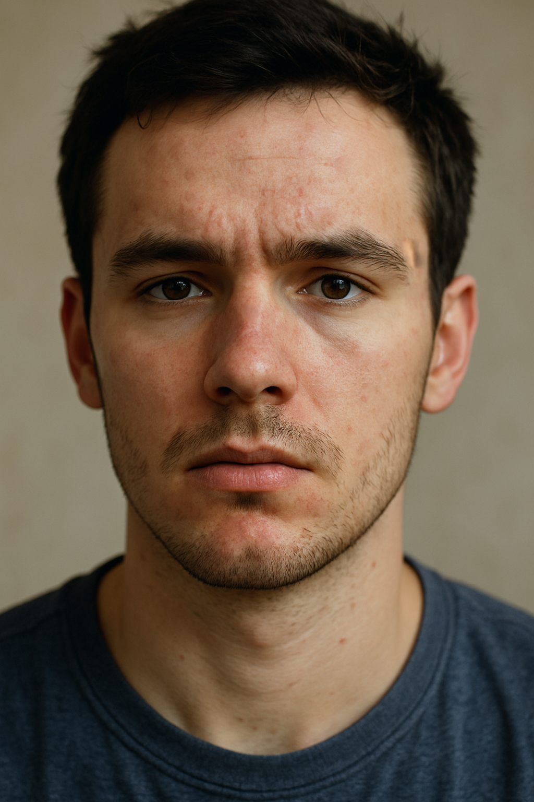

# Blemish Removal Tool

An interactive blemish removal application built with OpenCV, illustrating how to combine texture analysis and seamless cloning to clean up facial imperfections. This README focuses on the underlying concepts and workflow, serving as a guide for learners and practitioners.

---

## Key Concepts

1. **Texture Variance Estimation**  
   - Convert each candidate patch to HSV and apply a Laplacian filter on the V (value) channel.  
   - Square and sum the Laplacian response to measure texture variance—smoother regions yield lower values.

2. **Patch Selection Strategy**  
   - For a user-clicked blemish center, sample possible source patches in eight compass directions at twice the patch radius.  
   - Compute each patch’s variance; choose the one with minimal variance (the smoothest background) for cloning.

3. **Seamless Cloning**  
   - Use OpenCV’s `cv::seamlessClone()` to blend the selected patch into the blemish region.  
   - A circular mask defines the blending region, ensuring a natural transition without harsh edges.

4. **Interactive GUI with Mouse Callbacks**  
   - A resizable window listens for left-click events—each click triggers patch selection and cloning.  
   - Keyboard controls:  
     - **C**: Reset to the original image.  
     - **Esc**: Exit the application.

---

## Workflow Overview

1. **Load Image**: Robust I/O functions ensure clean loading and saving.  
2. **Display Window**: A named, resizable window presents the current state.  
3. **Handle Clicks**: On each click, compute and select the best patch, then apply seamless cloning in-place.  
4. **User Controls**: Reset or exit based on key presses.

---

## Code Highlights

- `computePatchVariance(patch)`: Quantifies texture via second-order derivatives.  
- `selectBestPatch(image, center, radius)`: Searches multiple directions and compares variance.  
- `onMouse(...)` Callback: Integrates GUI events with image processing routines.  
- **Modular Design**: I/O, variance computation, patch selection, and interaction logic are separated for clarity.

---

## Example Outputs

| Original Image                 | After Blemish Removal          |
| ------------------------------ | ------------------------------ |
|   |   |

> **Tip**: Try clicking on different blemish sizes and experiment with the patch radius to see how selection affects the result.

---

## Learning Takeaways

- Practical use of Laplacian filters to guide algorithmic decisions.  
- Hands-on experience with OpenCV’s Photo module (`seamlessClone`).  
- Designing user-friendly tools: clear controls, feedback loops, and reset functionality.

---

## Potential Extensions

- Experiment with adaptive patch radius or non-circular masks.  
- Replace variance metric with gradient magnitude or entropy.  
- Automate blemish detection via thresholding or blob detection before manual clicking.  
- Integrate color correction steps to handle lighting differences between source and target.  
