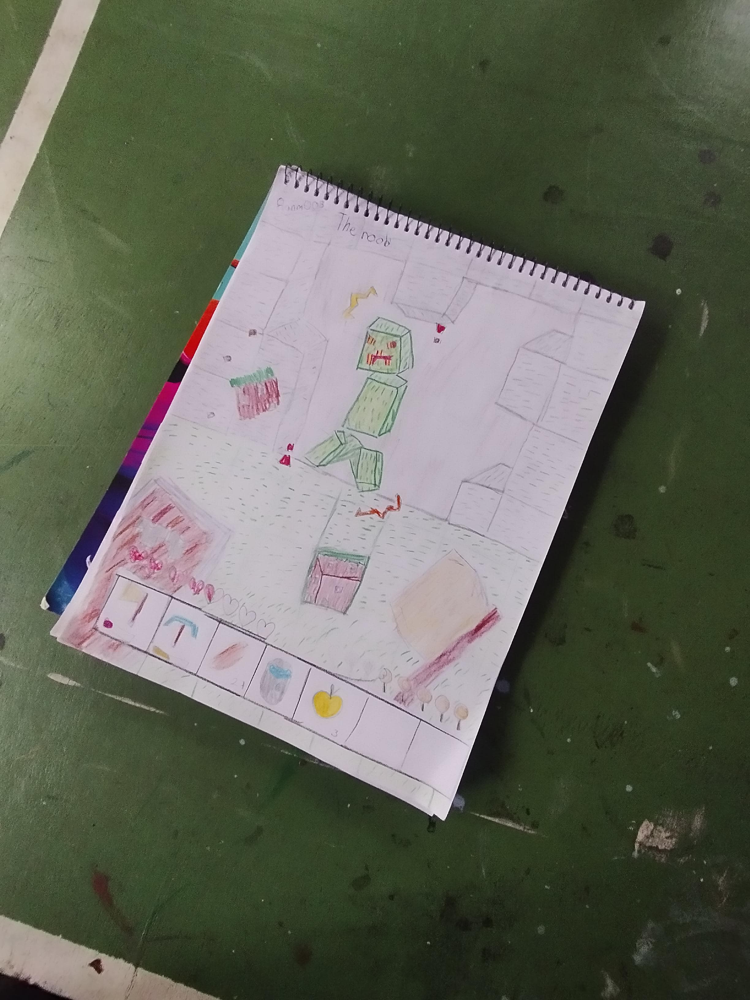
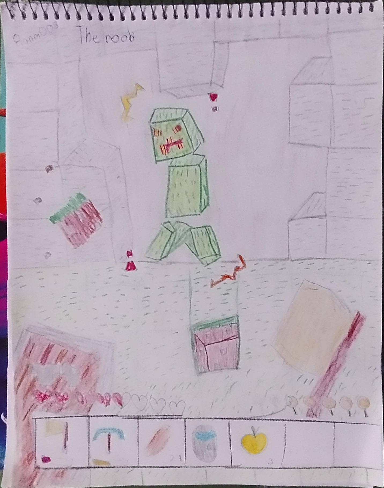
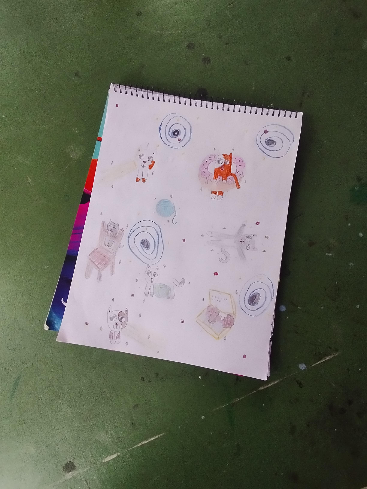
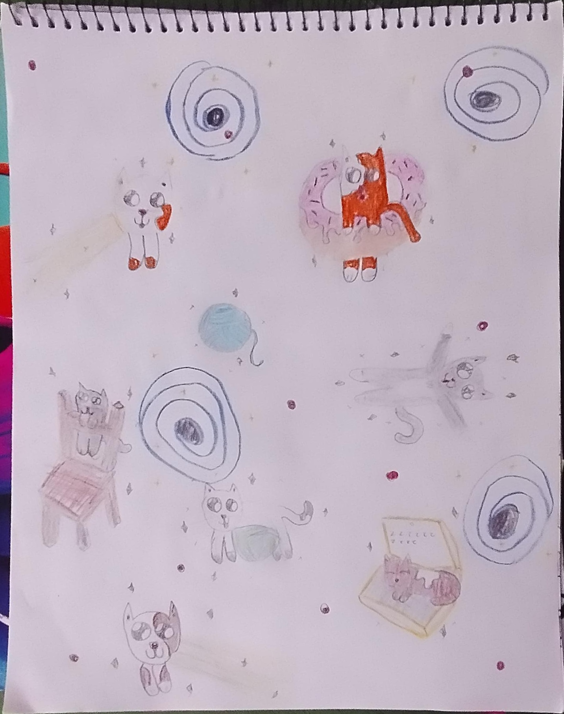
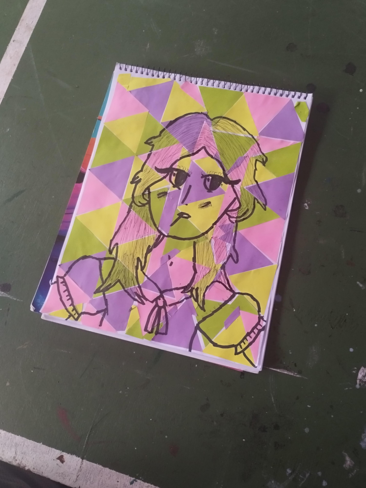
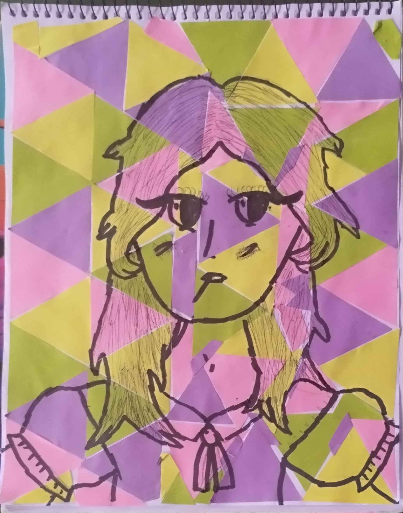

# Document Scanner: Perspective Correction & “Scanned” Output

**Document Scanner** is a demonstration of how to detect a rectangular document in a photograph and remap its four corners to a fronto-parallel view using homography (perspective warp). It’s designed as an educational piece—showing each step in C++ with OpenCV—from edge extraction to contour approximation to computing the homography matrix and warping the original image.

---

## What It Does

1. **Load Input Images**  
   Iterates over a set of sample document photos (hand-drawn pages, forms, etc.). Each photo is assumed to contain a roughly rectangular “document” on a contrasting background.

2. **Extract Intensity (V) Channel**  
   Converts the original BGR image to HSV color space and isolates the V (value/intensity) channel. Working on the V channel helps emphasize pencil or pen strokes against paper.

3. **Clean Edge Detection**  
   - Applies a Gaussian blur on the V channel (kernel size 17×17, σ=3.3) to remove fine noise.  
   - Runs the Canny edge detector (thresholds 25 and 40, aperture 3) to extract edges.  
   - Performs morphological closing (3×3 cross-shaped kernel, 10 iterations) to close small gaps in the edges.  
   - Finally, dilates (same 3×3 kernel, 6 iterations) to thicken the edge mask so that it more reliably captures the document’s border.

4. **Find Largest Quadrilateral Contour**  
   - Finds all external contours in the cleaned edge mask.  
   - Approximates each contour to a polygon using `approxPolyDP(ε = 0.1 × perimeter)`.  
   - Keeps the polygon with exactly four vertices and maximum area—this is assumed to be the document boundary.

5. **Order Corner Points**  
   - Sorts the 4 detected points by y-coordinate to split them into two “top” points and two “bottom” points.  
   - Within each pair, sorts by x-coordinate to identify top-left, top-right, bottom-left, and bottom-right.

6. **Compute Destination Size**  
   - Measures the distance between top-left & bottom-left and top-right & bottom-right to find the document’s height.  
   - Measures the distance between top-left & top-right and bottom-left & bottom-right to find the document’s width.  
   - Rounds to integer values to produce the final target dimensions (width × height).

7. **Compute Homography & Warp**  
   - Uses `getPerspectiveTransform(srcPts, dstPts)` on the four ordered corners to compute a 3×3 homography matrix.  
   - Warps the original color image into the new fronto-parallel rectangle of the computed size.  

8. **Display & Save Results**  
   - Resizes the warped (scanned) image back to the original photograph’s dimensions and concatenates it side-by-side with the original photograph.  
   - Displays that side-by-side composite for visual verification.  
   - Saves each warped output as `scanned_<original_filename>` in the same folder for archival.

---

## Pipeline Overview

```text
Original BGR Image (e.g. “doc1.jpg”)
          │
          ▼
Convert to HSV → extract V channel (CV_8U)
          │
          ▼
Gaussian Blur (17×17, σ=3.3) → Canny Edge (25, 40, aperture=3)
          │
          ▼
Morphological Close (3×3 cross, 10 iter) → Dilate (same kernel, 6 iter)
          │
          ▼
findContours → approxPolyDP(ε=0.1·perimeter)
          │
          ▼
Select largest 4-vertex polygon → sort corners [TL, TR, BL, BR]
          │
          ▼
Compute docWidth = max(‖TL–TR‖, ‖BL–BR‖)
       docHeight= max(‖TL–BL‖, ‖TR–BR‖)
          │
          ▼
getPerspectiveTransform(srcCorners, dstCorners)
          │
          ▼
warpPerspective → “scanned” fronto-parallel image
          │
          ▼
Side-by-side: [Original | Resized Scanned] → display + save
```

---

## Key Techniques & Notes

- **Gaussian Blur on V Channel**  
  Working on intensity (V) avoids color distractions—emphasizes pen/pencil strokes on paper. A large 17×17 blur (σ=3.3) suppresses small texture so that Canny focuses on strong edges (document borders, bold strokes).

- **Canny + Morphology**  
  Canny parameters (thresholds 25/40) are tuned to detect paper‐edge contrasts. Morphological closing (cross shape) and dilation strengthen the detected border so that the subsequent contour‐finding is robust even if parts of the border are faint or broken.

- **Contour Approximation (approxPolyDP)**  
  The epsilon = 0.1 × perimeter criterion ensures that only contours that are truly quadrilateral (or close to it) remain. We discard any polygon with >4 or <4 vertices. Among all 4-vertex polygons, we pick the one with maximum area.

- **Corner Sorting Logic**  
  1. Sort all four points by y ascending.  
  2. Top-two points → split by x ascending ⇒ top-left, top-right.  
  3. Bottom-two points → split by x ascending ⇒ bottom-left, bottom-right.

- **Dimension Computation**  
  - Height = max(dist(TL, BL), dist(TR, BR)).  
  - Width = max(dist(TL, TR), dist(BL, BR)).  
  This keeps the document from being skewed or “stretched” by an unusual corner ordering.

- **getPerspectiveTransform**  
  Takes exactly four source points and four destination points. More efficient (and exact for 4‐point correspondences) than using `findHomography`. The result is a 3×3 matrix that we pass to `warpPerspective`.

- **Side-by-Side Display**  
  For quick comparison, we resize the warped output to the same size as the original photograph, then place them horizontally adjacent. This allows visual verification that the document now appears fronto-parallel (pages of text appear rectangular, straight, and not trapezoidal).

---

## Example Results

Below are three hand-drawn “documents” scanned by this program. Each pair shows the original photo (left) and the perspective-corrected output (right) concatenated side-by-side.

### Example 1: `doc1.jpg`

| Original (`data/doc1.jpg`) | Scanned (`data/scanned_doc1.jpg`) |
|:--------------------------:|:---------------------------------:|
|      |  |

---

### Example 2: `doc4.jpg`

| Original (`data/doc4.jpg`) | Scanned (`data/scanned_doc4.jpg`) |
|:--------------------------:|:---------------------------------:|
|      |  |

---

### Example 3: `doc5.jpg`

| Original (`data/doc5.jpg`) | Scanned (`data/scanned_doc5.jpg`) |
|:--------------------------:|:---------------------------------:|
|      |  |

*(These images were hand-drawn by my younger sister. Notice how the warped outputs correct perspective so that every corner becomes a right angle.)*

---

## Who Should Study This

- **OpenCV Learners & Enthusiasts**  
  - See a complete end-to-end example of document detection, contour approximation, homography computation, and perspective warp—all in pure C++.  
  - Learn how to extract an intensity channel (HSV → V), apply Canny + morphology, and robustly identify a four-point polygon.

- **Computer Vision & Robotics Developers**  
  - Use this pipeline as a building block for OCR preprocessing (e.g., scanning forms before text recognition).  
  - Understand how to handle perspective distortions in mobile “scan” apps.

- **C++ Developers**  
  - Observe clear function separation (edge mask computation, contour filtering, corner sorting, homography calculation).  
  - Use this as a reference for GPU-free, lightweight image processing on real-time or batch images.  

Explore the source code for detailed comments at every step, and adapt it to your own document-scanning or perspective-correction needs!
