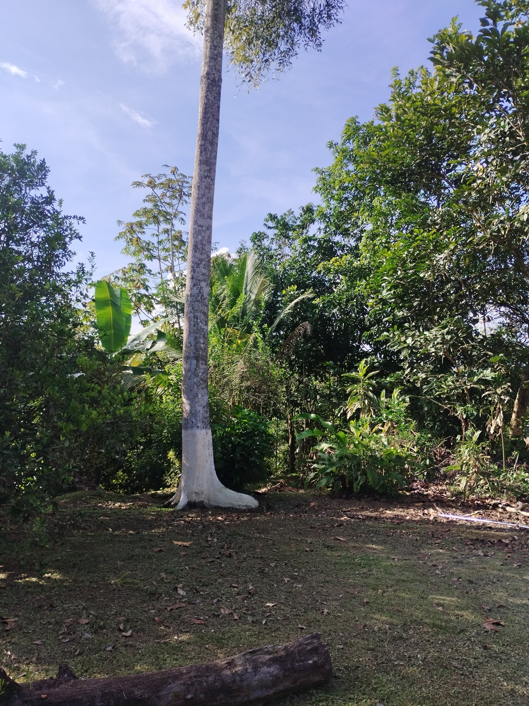
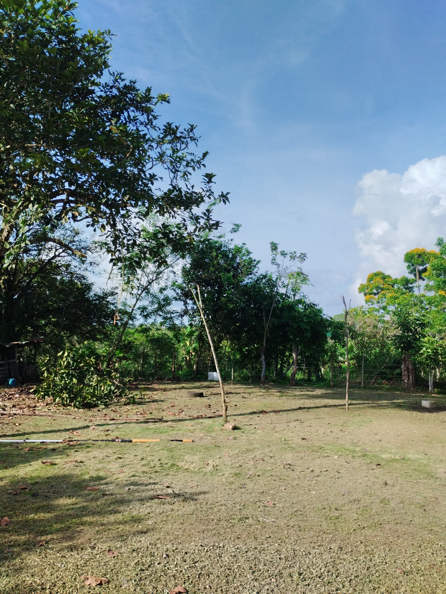
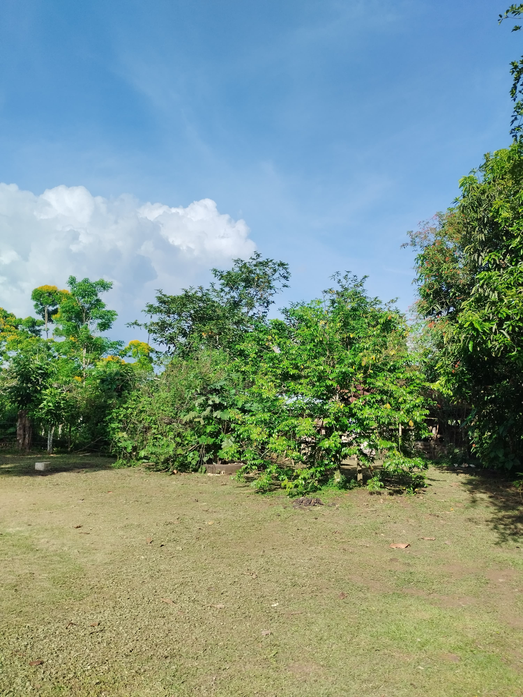

# Panorama Stitching

This project demonstrates how to assemble multiple overlapping images into a single panoramic view using OpenCV’s high-level stitching API. Instead of focusing on build instructions (handled in the root README.md), this document explains the algorithms and C++ techniques applied, making it easier for learners and code reusers to understand the implementation.

1. **Directory Traversal with std::filesystem**  
   - Goal: Automatically gather all image files from a specific folder.  
   - Techniques:  
     - `std::filesystem::directory_iterator` to iterate directory entries  
     - File filtering by extension (e.g., `.jpeg`)  
     - Fast-fail `std::runtime_error` if the directory is missing or invalid  

2. **Robust Image Loading**  
   - Goal: Load only valid images, skipping corrupted or unreadable files.  
   - Techniques:  
     - `cv::imread` and check for empty `cv::Mat`  
     - Log warnings and continue on failures  

3. **Consistent Ordering**  
   - Goal: Ensure the stitcher processes images in a predictable sequence.  
   - Technique:  
     - `std::sort` on a vector of `std::filesystem::path`  

4. **Panorama Stitching with OpenCV**  
   - Goal: Combine a series of images into one seamless panorama.  
   - Component: `cv::Stitcher`  
     1. Feature detection and matching (ORB/SIFT)  
     2. Camera parameter estimation (homographies)  
     3. Seam finding and blending  
     4. Status codes (`Stitcher::OK`, `ERR_NEED_MORE_IMAGES`, etc.)  

5. **Saving the Result**  
   - Goal: Persist the final panorama to disk with guaranteed success.  
   - Technique: Wrap `cv::imwrite` in a helper that exits on failure with a clear error message.  

6. **Error Handling and User Feedback**  
   - Distinct messages for:  
     - Missing/empty directory  
     - Insufficient valid images  
     - Stitching failures  
     - File write errors  

---

## Example Outputs

| Sample Input Frames                                             | Stitched Panorama             |
| --------------------------------------------------------------- | ----------------------------- |
|    |  |

> **Tip**: For best results, use images shot from a single rotation point with at least 30% overlap and consistent exposure settings.

---

## Learning Takeaways

- Modern C++ with `<filesystem>` for portable directory operations  
- High-level OpenCV stitching API abstracts feature matching and blending  
- Defensive programming: clear exception messages and return-code checks  
