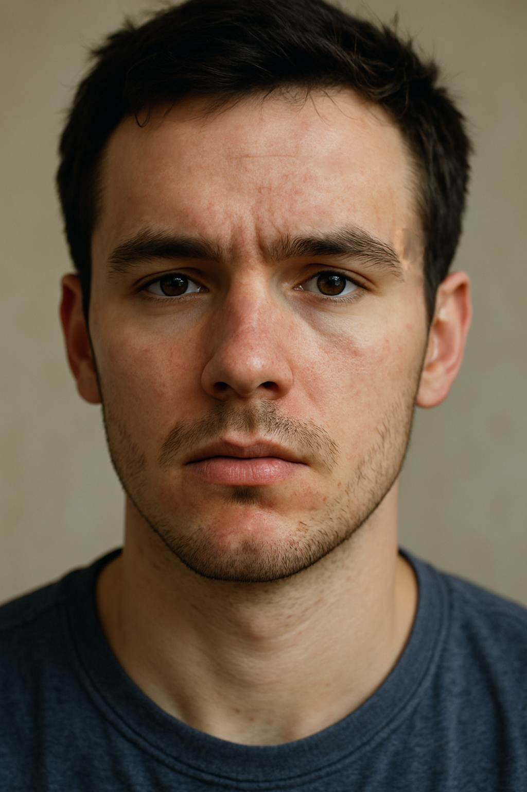
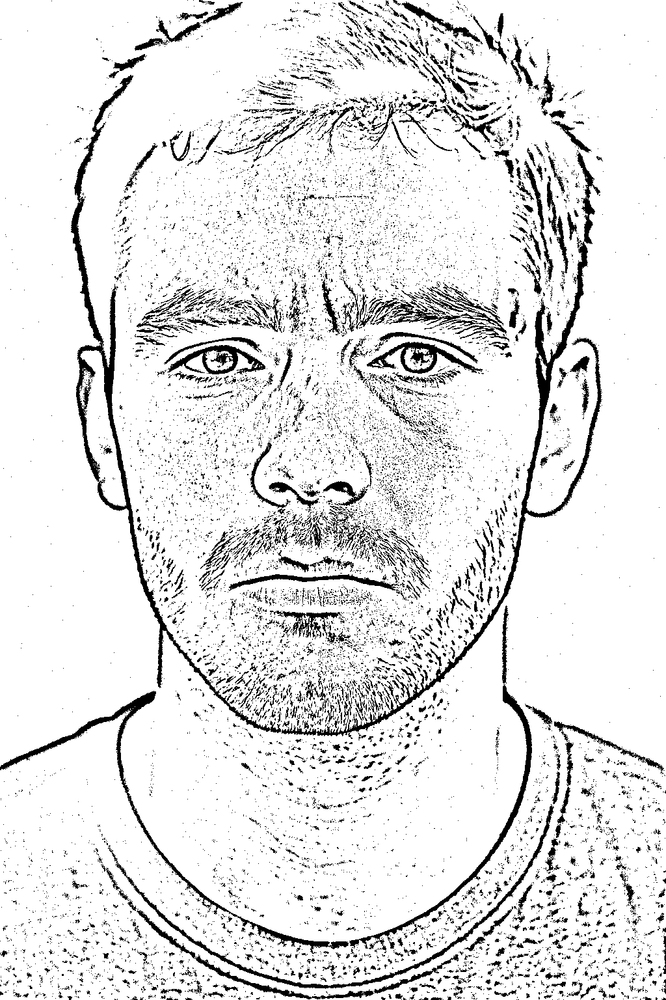
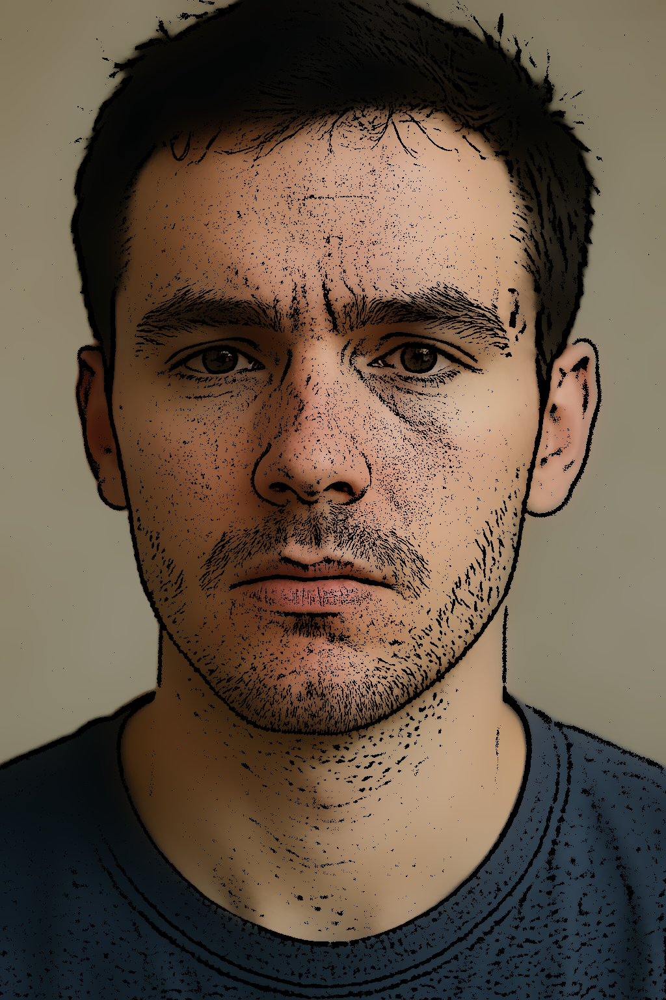

# Pencil Sketch & Cartoon Filter

This project demonstrates two complementary image-processing techniques using OpenCV in C++:

- **Pencil Sketch**: Extracts linear, hand-drawn–style strokes by high-pass filtering the brightness channel.  
- **Cartoon Effect**: Blends a color-smoothed version of the image with the sketch strokes to produce a stylized, cartoon-like output.

---

## Core Concepts

1. **Pencil Sketch via High-Pass Filtering**  
   1. **Brightness Extraction**: Convert BGR → HSV and isolate the V (value) channel.  
   2. **Low-Pass Blur**: Gaussian blur on V to capture broad lighting (low frequencies).  
   3. **High-Pass Approximation**: Subtract blurred V from original V—enhances edges/strokes.  
   4. **Thresholding**: Inverse binary threshold so dark strokes appear white on black.

2. **Cartoonification via Bilateral Filtering & Mask Blending**  
   1. **Color Smoothing**: Apply `cv::bilateralFilter` to reduce noise while preserving edges.  
   2. **Mask Inversion**: Invert the sketch mask (strokes → 0, flat areas → 1).  
   3. **Mask Application**: Combine inverted mask with smoothed image to overlay strokes on color.

---

## Code Structure

- **Utility Functions**  
  - `loadImageOrExit()`, `saveImageOrExit()`, `showImage()` for robust I/O and display.  
- **`computeSketchMask(const cv::Mat&)`**  
  Implements the high-pass sketch generation.  
- **`pencilSketch(const cv::Mat&)`**  
  Returns the binary sketch image.  
- **`cartoonify(const cv::Mat&)`**  
  Applies bilateral smoothing, generates/inverts the sketch mask, and blends.  
- **`main()`**  
  1. Builds input/output paths.  
  2. Loads source image.  
  3. Calls `pencilSketch` and `cartoonify`.  
  4. Displays and saves `resultSketch.png` & `resultCartoon.png`.  

---

## Example Outputs

| Original Image                | Pencil Sketch Result          | Cartoon Effect Result         |
| ----------------------------- | ----------------------------- | ----------------------------- |
|     |  |  |

> **Tip**: Experiment with Gaussian kernel sizes and bilateral filter parameters to achieve different artistic styles—try larger sigma values for softer cartoons or finer strokes for sharper sketches.

---

## Learning Points

- **Frequency Separation**: How Gaussian blur + subtraction isolates edges (high freqs) vs. smooth regions (low freqs).  
- **Edge-Preserving Smoothing**: Why bilateral filters keep contours while reducing noise.  
- **Masking Techniques**: Inverting and applying masks to selectively combine image channels.  
- **Pipeline Design**: Modular functions for clarity and easy extension.

---

## Extensions & Experiments

- **Adaptive Parameters**: Auto-tune blur and threshold based on image statistics.  
- **Color Quantization**: Add k-means before smoothing for flat “cell-shaded” regions.  
- **Adaptive Thresholding**: Handle uneven lighting for more consistent sketches.  
- **Video Mode**: Adapt pipeline for real-time cartoon previews on live camera input.

Use this code as a foundation to explore stylized filters and edge-based processing in C++ with OpenCV.  