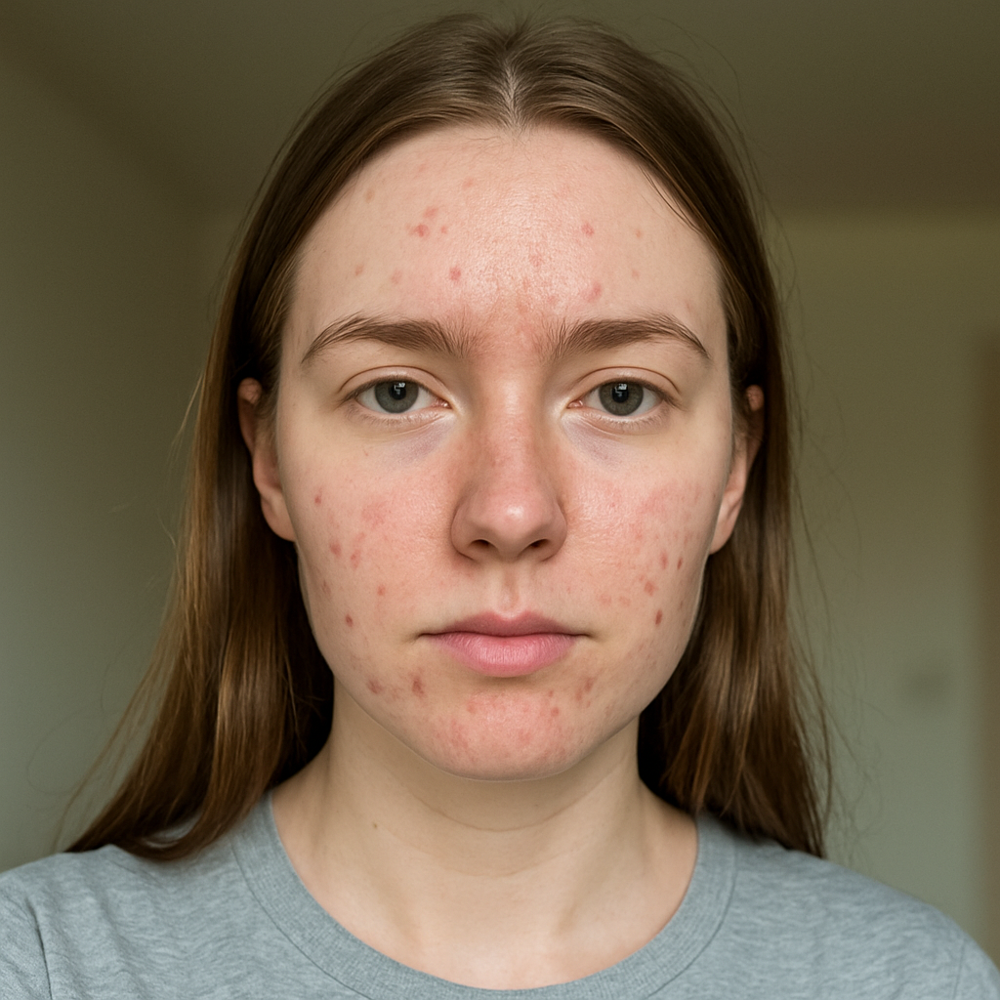
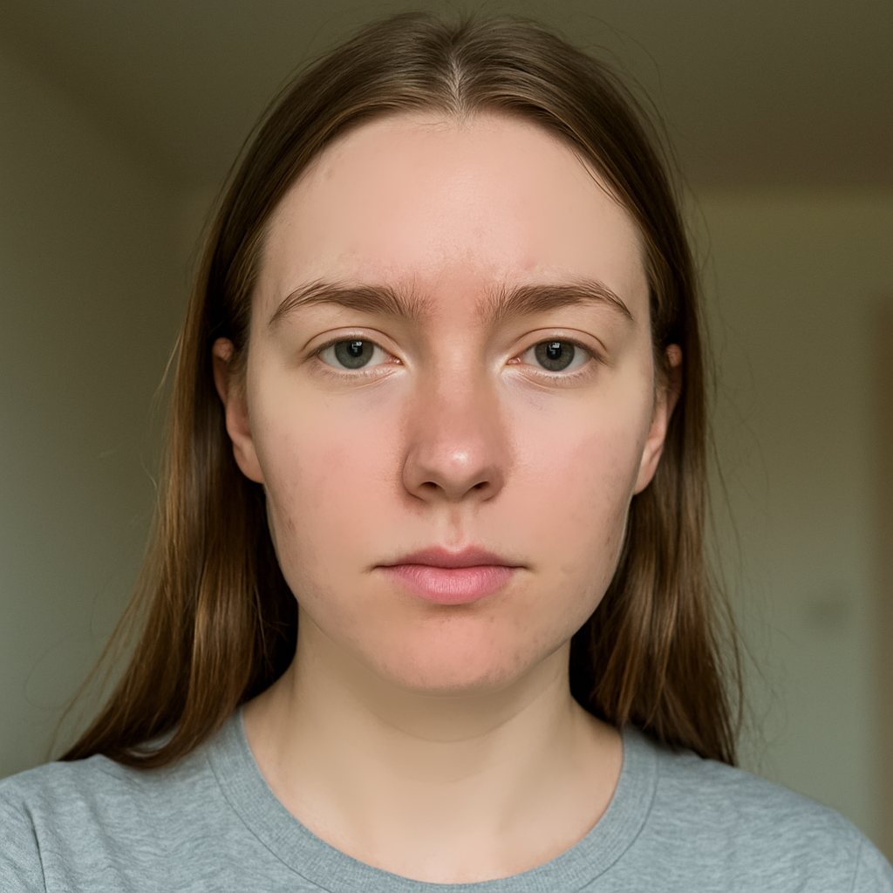

# Skin Smoothing & Automatic Blemish Removal

This demo is an evolution of the **blemish_removal** project, adding fully-automatic skin smoothing and spot-correction using a combination of classical and mask-based techniques. It’s designed to showcase how to build a robust face-aware beauty filter entirely in C++ with OpenCV.

---

## What It Does

1. **Face & Eye Detection**  
   Uses Haar cascades to locate the face and eye regions.

2. **Skin-Color Modeling**  
   Samples the central face patch to build a 2D HSV histogram model of your skin tone.

3. **Initial Skin Mask Generation**  
   Applies color thresholding in HSV space, followed by morphological opening, to isolate potential skin pixels.

4. **Mask Refinement with GrabCut**  
   Treats the color-based mask as a trimap and refines it using GrabCut for crisp boundaries around the face.

5. **Blemish Detection**  
   Within the refined skin region, computes gradient magnitudes on the hue channel and runs blob detection to find spots or imperfection candidates.

6. **Seamless Blemish Removal**  
   For each detected blemish, searches eight directions for a nearby low-texture patch (via Laplacian variance), then uses `seamlessClone` to copy that patch over the spot.

7. **Final Skin Smoothing**  
   Applies a bilateral filter selectively to the corrected face area and blends it back with the original frame for a natural look.

---

## Pipeline Overview

```text
input image
     ↓
[face + eye detection] ──► compute rough face mask
     ↓
[skin color sampling & histogram thresholds]
     ↓
[HSV threshold → morphology] ──► initial mask
     ↓
[GrabCut refinement] ──► refined skin mask
     ↓
[gradient analysis + blob detection] ──► blemish keypoints
     ↓
[low-texture patch search + seamlessClone] ──► blemish-removed image
     ↓
[bilateral smoothing on mask] ──► final smoothed image
```

---

## Key Techniques & Innovations

- **Adaptive Skin Model**  
  Rather than hard-coded thresholds, uses per-image statistics (mean ± σ) on hue & saturation.

- **Mask-Driven GrabCut**  
  Leverages an initial binary mask to guide GrabCut, yielding precise skin outlines without manual ROI.

- **Texture-Aware Patch Selection**  
  Computes variance via a Laplacian filter on the hue channel to find the flattest nearby areas for seamless cloning.

- **Selective Bilateral Filtering**  
  Smooths only the face region, preserving background and sharp details elsewhere.

---

## Example Outputs

| Original Frame | After Blemish Removal | Final Smoothed Result |
| -------------- | --------------------- | --------------------- |
|  |  |  |

---

## Who Should Explore This

- **Computer Vision Enthasts** looking to see a full demo of face-aware filtering pipelines in pure C++.
- **OpenCV Learners** wanting to understand how to combine color modeling, GrabCut, blob detection and seamless cloning.
- **Graphics/Imaging Developers** curious about creating lightweight beauty filters without deep learning.

Explore the code to learn how each stage is implemented, and adapt the hooks (cascade models, mask parameters, filter kernel sizes) to your own datasets or video streams!
