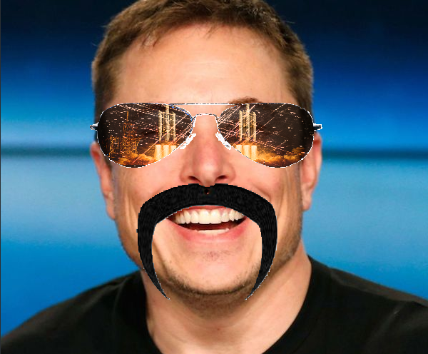

# Sunglasses++: Interactive Face Filter Demo

**Sunglasses++** is an educational OpenCV project demonstrating how to build a real-time face filter pipeline in C++. It overlays customizable sunglasses (with adjustable reflection and alpha blending), optional mustaches, and scratch/flare effects on detected faces across both webcam streams and static images.

---

## What It Does

1. **Input Sources**  
   - Webcam feed  
   - Preloaded static images (e.g., `musk.jpg`, `face1.png`, etc.)

2. **Face Detection & Tracking**  
   - Uses a Haar Cascade (`haarcascade_frontalface_default.xml`) to detect faces in the first frame (or at regular intervals).  
   - Initializes a `MultiTracker` of MedianFlow trackers to follow each detected face across subsequent frames, reducing redundant detections.

3. **Sunglasses Overlay**  
   - Loads a base “sunglassRGB.png” image (with black background).  
   - Builds two binary masks: one for the frame (glasses’ opaque parts) and one for the lenses (transparent area).  
   - Adjusts a reflection texture by concatenating left/right slices of a selected “glasses image” and applying contrast control.  
   - Resizes both the frame and lens masks to match the face’s width (keeping aspect ratio).  
   - Blends the sunglasses onto the face ROI using alpha channels:  
     - Frame pixels use user-controlled alpha (0–100).  
     - Lens pixels are fully opaque (always show reflection).  
   - Optionally applies a scratch/flare “effect” on the lenses by computing a Sobel gradient mask of a chosen “effect image” and modulating hue/saturation of the blended overlay.

4. **Mustache Overlay**  
   - Loads a selected mustache JPG (with a small red marker under the intended nose position).  
   - Constructs a binary mask where nearly-white pixels are treated as background, everything else as mustache.  
   - Finds the centroid of the red marker to position the mustache correctly under the nose.  
   - Rescales and alpha-blends the mustache onto each detected face so it always sits in the proper proportional area.

5. **Real-Time Parameter Control**  
   - A separate “Options” window hosts trackbars for:  
     - **Source** (Webcam or one of the static images)  
     - **Glasses Image** (choose among multiple PNGs)  
     - **Reflection Contrast** (0–100)  
     - **Glasses Alpha** (0–100)  
     - **Glasses Effect** (select one scratch/flare overlay)  
     - **Effect Intensity** (0–100)  
     - **Mustache Option** (choose among mustache JPGs)

6. **Educational Focus**  
   - Exposes all intermediate steps (masks, blending, color-space conversions) in clearly documented functions.  
   - Demonstrates how to combine Haar detection, MedianFlow tracking, composite masking, alpha blending, and HSV-space manipulations in a single pipeline.

---

## Pipeline Overview

```text
┌───────────────────────────────────────────────────┐
│                   Input Frame                    │
│   (Webcam or Static Image, BGR 8-bit)            │
└───────────────────────────────────────────────────┘
                 │             │
                 │ Face        │
                 │ Detection   │
                 ▼             ▼
  ┌─────────────────────────────────────────────┐
  │       Haar Cascade (grayscale → equalize)  │
  │       → vector<Rect> faceBoxes             │
  └─────────────────────────────────────────────┘
                 │ (if new detection needed)
                 ▼
  ┌─────────────────────────────────────────────┐
  │ Initialize MultiTracker (MedianFlow)       │
  │  • For each faceBox: add tracker           │
  └─────────────────────────────────────────────┘
                 │
                 ▼
  ┌─────────────────────────────────────────────┐
  │   MultiTracker.update(frame)               │
  │   → updated vector<Rect2d> trackedBoxes    │
  └─────────────────────────────────────────────┘
                 │
                 ▼
  ┌─────────────────────────────────────────────┐
  │   For each faceBox:                        │
  │   • Overlay Sunglasses                     │
  │     – Compute & resize masks (frame + lens)│
  │     – Create reflection texture (contrast) │
  │     – Alpha blend onto frame ROI           │
  │     – Optionally apply scratch/flare effect│
  │   • Overlay Mustache                       │
  │     – Build mask (non-white pixels)        │
  │     – Locate red marker under nose         │
  │     – Resize and alpha blend onto ROI      │
  └─────────────────────────────────────────────┘
                 │
                 ▼
  ┌─────────────────────────────────────────────┐
  │         Display Composited Frame           │
  └─────────────────────────────────────────────┘
```

- Face detection is forced every **20 frames** or whenever a tracked bounding box moves fully out of view.  
- All masks and overlays are resized per-face, using proportional scaling so that glasses/mustache always fit correctly regardless of face size.  
- Effects on lenses are computed in HSV space: a Sobel gradient mask from a chosen image modulates saturation/brightness on the blended sunglasses.

---

## Key Techniques & Implementation Details

- **Haar Cascade & Equalized Grayscale**  
  - Improves face detection robustness under varying lighting.  
  - Uses `haarcascade_frontalface_default.xml` with `detectMultiScale()`.

- **MultiTracker (MedianFlow)**  
  - After initial detection, MedianFlow trackers follow each face ROI to avoid expensive repeated cascade runs.  
  - All trackers are reinitialized every 20 frames or when a bounding box no longer overlaps the frame.

- **Binary Masks for Sunglasses**  
  - **`maskWholeBase`** identifies every non-black pixel in the original PNG (all glasses + lenses).  
  - **`maskFrameBase`** isolates the solid frame region by thresholding out nearly-black/invisible areas.  
  - **`maskLens = maskWholeBase – maskFrameBase`** yields a mask for the transparent lens region.  
  - Frame region uses a user-controlled alpha (0..100), while lens region is always fully opaque for reflection.

- **Reflection Texture**  
  - Takes a chosen PNG from `glasses_images/`, enhances contrast (`convertTo()` with α/β), then concatenates left & right slices to tile into one texture.  
  - Resizes this tiled texture to the same dimensions as the final glasses overlay.  
  - Copies it into lens pixels via `copyTo(..., maskLensResized)` before blending with the underlying frame.

- **Alpha Blending**  
  - Converts both the resized glasses (with reflection) and the ROI of the original frame to `CV_32FC3` (normalized 0..1).  
  - Converts the combined alpha mask to `CV_32FC3` as well (`alpha3`).  
  - Blends:  
    ```
    blended = glasses_f.mul(alpha3) + roi_f.mul(1 – alpha3)
    ```  
  - Converts back to `CV_8UC3` and writes into the frame ROI.

- **Lens Scratch/Flare Effect**  
  - Loads an “effect image” (from `effects_images/`), converts to grayscale, applies Sobel in X and Y to compute gradient magnitude.  
  - Normalizes that gradient (0..255), resizes to match the glasses overlay, then thresholds to a float mask [0..1].  
  - In HSV space, reduces Saturation and increases Value in pixels where the mask is high, creating a scratch/flare look.

- **Mustache Overlay**  
  - Loads the chosen JPG, detects nearly-black pixels as mustache (white background becomes mask).  
  - Finds the centroid of a small red dot (under the intended “bridge of the nostrils”) via color threshold + moments.  
  - Rescales both mustache and mask so that mustache width = 60% of face width, preserving aspect ratio.  
  - Positions the mustache so the red‐dot center aligns under the nose (0.65 × face height).  
  - Performs a simple alpha blend (mask × mustache + (1−mask) × ROI).

- **Real-Time UI with Trackbars**  
  - Single “Options” window with seven trackbars to tweak:  
    1. **Source** (Webcam or static image indices)  
    2. **Glasses Image** (index into 7 PNG choices)  
    3. **Reflection Contrast** (0..100 → controls α/β in `convertTo`)  
    4. **Glasses Alpha** (0..100 → frame opacity)  
    5. **Glasses Effect** (index into 4 scratch/flare PNGs)  
    6. **Effect Intensity** (0..100 → modulates HSV channels)  
    7. **Mustache Option** (index into 14 JPG choices)

---

## Example Output

Below is a sample output for one of the static test images (located in `data/result.png`). It shows:
- **Top**: Original static image (`musk.jpg` in this case).  
- **Bottom**: Composite result with chosen sunglasses, reflection, and mustache overlays.

<p align="center">
  
  <br><em>Example: Using a source from the dataset</em>
</p>

*(Note: You can change `Source → 1`, `Glasses Image → 1`, set `Reflection Contrast = 50`, `Glasses Alpha = 75`, `Glasses Effect = 1`, `Effect Intensity = 40`,and `Mustache Option = 1` to reproduce this exact result.)*

---

Feel free to browse the source files for detailed comments on each step. Extend or adapt the hooks (cascade model, tracking method, effect algorithm) to fit your own creative face-filter experiments!
