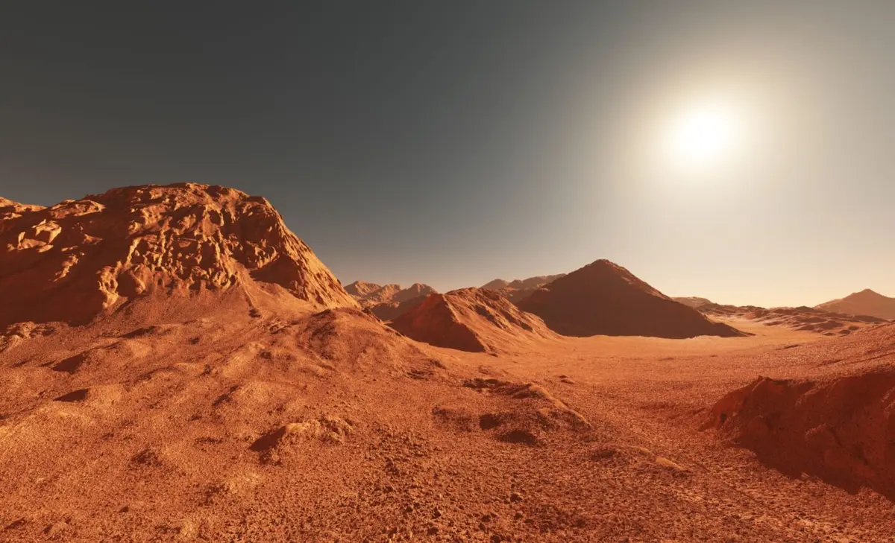
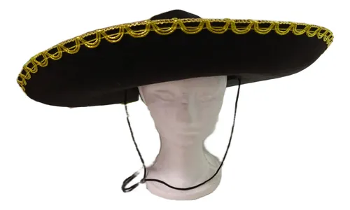
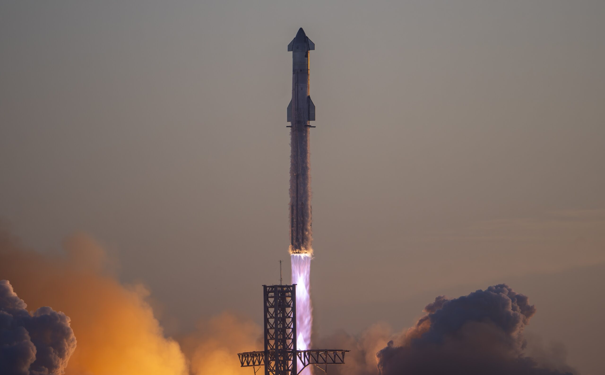
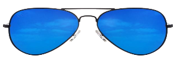
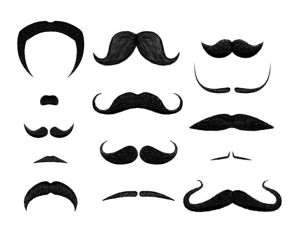
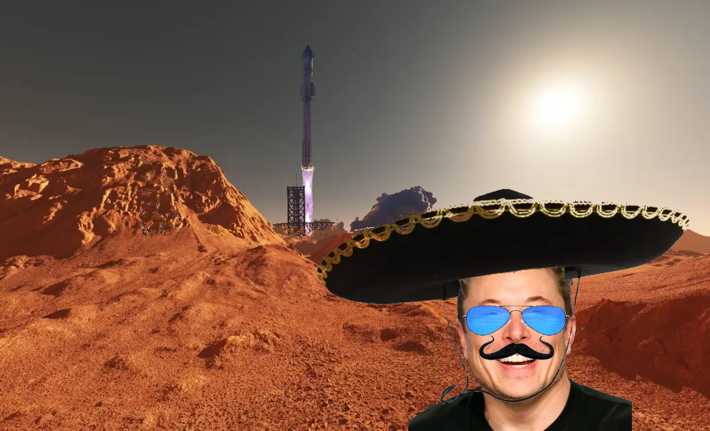

# Mars Composite Scene

This example shows how to build a fun “composite” image by overlaying multiple RGBA and BGR assets (glasses, mustache, starship, hat, and a portrait) onto a Mars background. Rather than focusing on build instructions, this README explains the key OpenCV concepts and techniques you can study or reuse.

1. **Robust Image I/O**  
   - `loadImageOrExit()` / `saveImageOrExit()`  
     Wraps `cv::imread` / `cv::imwrite` with error checks, so you never process an empty image.  
   - `std::filesystem::path`  
     Enables portable file handling (no hard-coded string concatenation).

2. **Creating Binary Masks with Thresholding**  
   Many compositing steps rely on generating masks that isolate “foreground” pixels:  
   ```cpp
   cv::inRange(input, cv::Scalar(minB, minG, minR),
               cv::Scalar(maxB, maxG, maxR), mask);
   ```  
   - **Whole-object mask**: captures everything but pure background (e.g. lenses, hats).  
   - **Fine masks**: by tweaking min/max values, you can separate subregions (e.g. glass frames vs. lenses).  
   Use multiple masks and bitwise operations (`cv::bitwise_or`) to refine coverage.

3. **Channel-Wise Math & Alpha Blending**  
   OpenCV images are split into B, G, R channels:  
   ```cpp
   cv::Mat channels[3];
   cv::split(src, channels);
   // operate on each channels[i] independently...
   cv::merge(channels, 3, dst);
   ```  
   - `cv::multiply()` scales pixel values by mask/255, implementing per-channel alpha blending.  
   - `cv::add()` merges foreground + background contributions.  
   By carefully ordering multiply/add steps, you achieve realistic transparency and smooth edges.

4. **Region-of-Interest (ROI) Manipulation**  
   To position a sticker or portrait:  
   1. Extract ROI from the background:  
      ```cpp
      cv::Mat roi = background(cv::Range(y, y+H),
                               cv::Range(x, x+W));
      ```  
   2. Blend your resized/thresholded asset into that ROI.  
   3. Copy back into the full image:  
      ```cpp
      blendedRoi.copyTo(background(cv::Range(y,y+H),
                                   cv::Range(x,x+W)));
      ```  
   This leverages optimized OpenCV routines instead of manual loops.

5. **Resizing & Scaling**  
   - `cv::resize()` with `INTER_LINEAR` lets you shrink or enlarge assets to fit your composition.  
   - A single scale factor (e.g. `0.22`) applied uniformly preserves aspect ratio.

6. **Layered Composition Workflow**  
   1. Start with the Mars background.  
   2. Place the starship, blending sky vs. land so it “sits” naturally.  
   3. Overlay the portrait with its own mask, then add accessories (glasses, mustache, hat) in separate steps.  
   4. Finalize by merging all channels back into one `cv::Mat`.  
   This pipeline illustrates how complex scenes emerge from simple building blocks: masks, ROIs, channel math, and blending.

7. **Key Takeaways**  
   - Threshold-based masks are powerful for quick object extraction.  
   - Channel-wise operations provide fine control over blending and transparency.  
   - ROIs let you handle subregions efficiently, avoiding manual pixel indexing.  
   - Structuring code into reusable functions (e.g. `loadImageOrExit`, mask generators) makes it easy to extend or repurpose.

---

## Example Outputs

| Input Assets                                                                                                  | Composite Scene Result           |
| ------------------------------------------------------------------------------------------------------------- | -------------------------------- |
|       |  |

> **Tip**: Try swapping in different assets, adjusting your mask thresholds, or reordering blend steps to create unique composite scenes.
